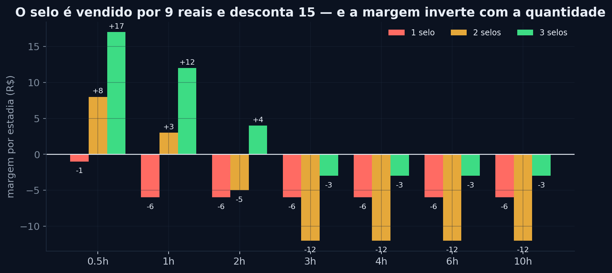
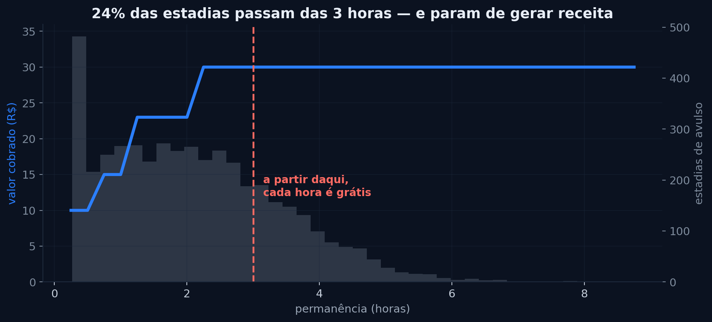
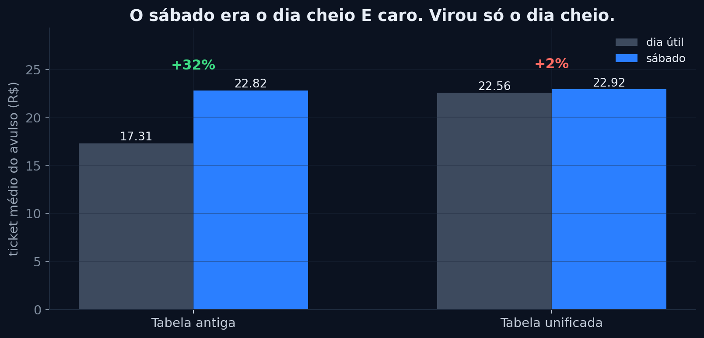
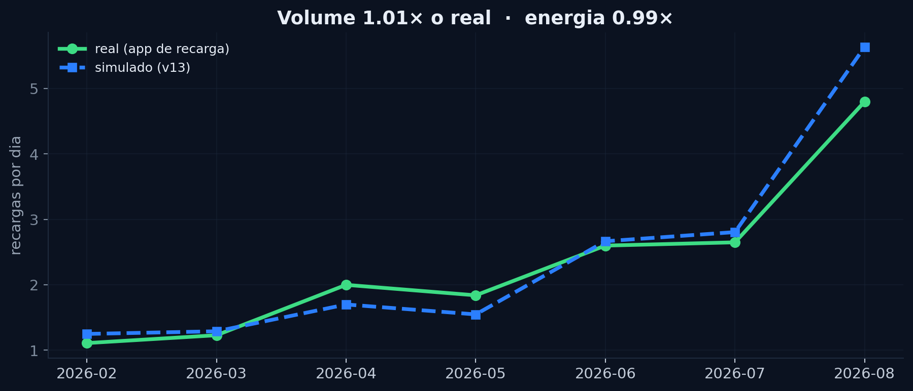
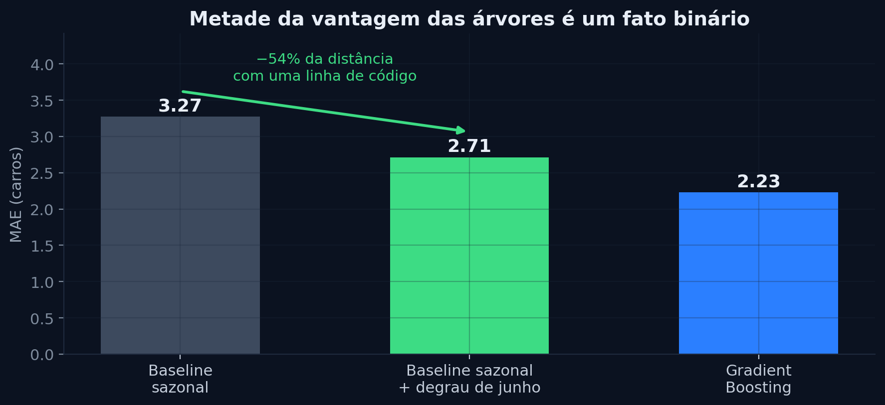
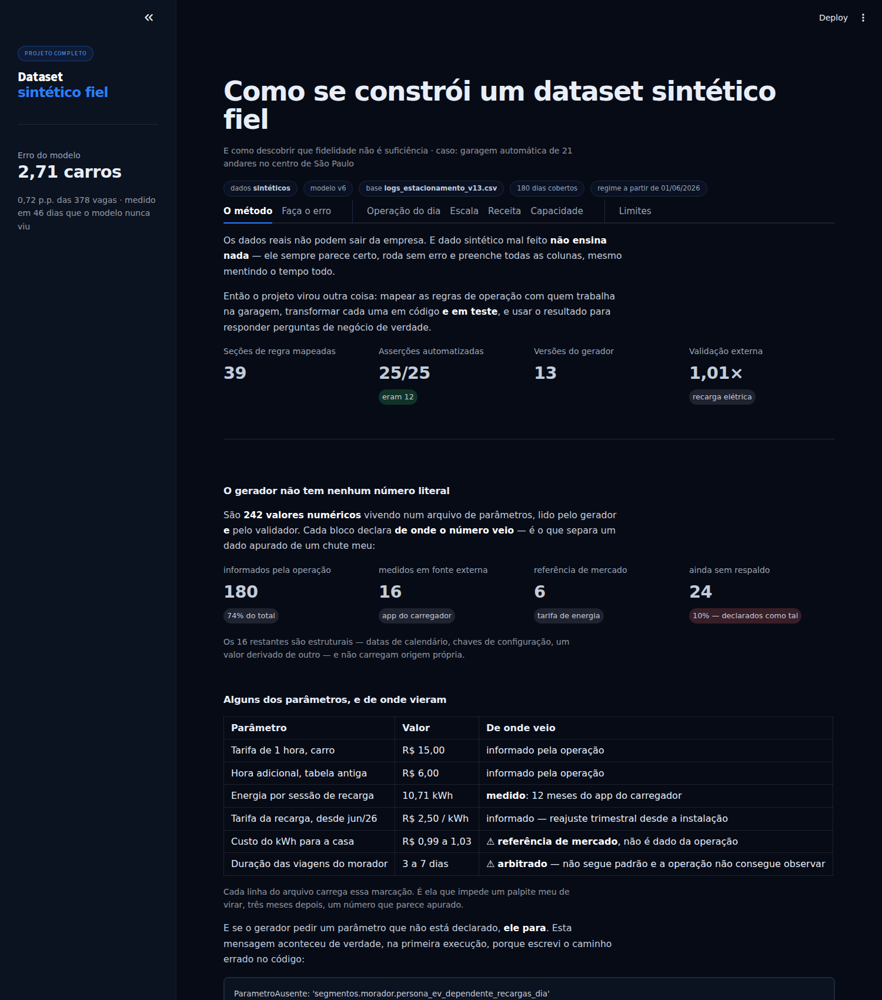
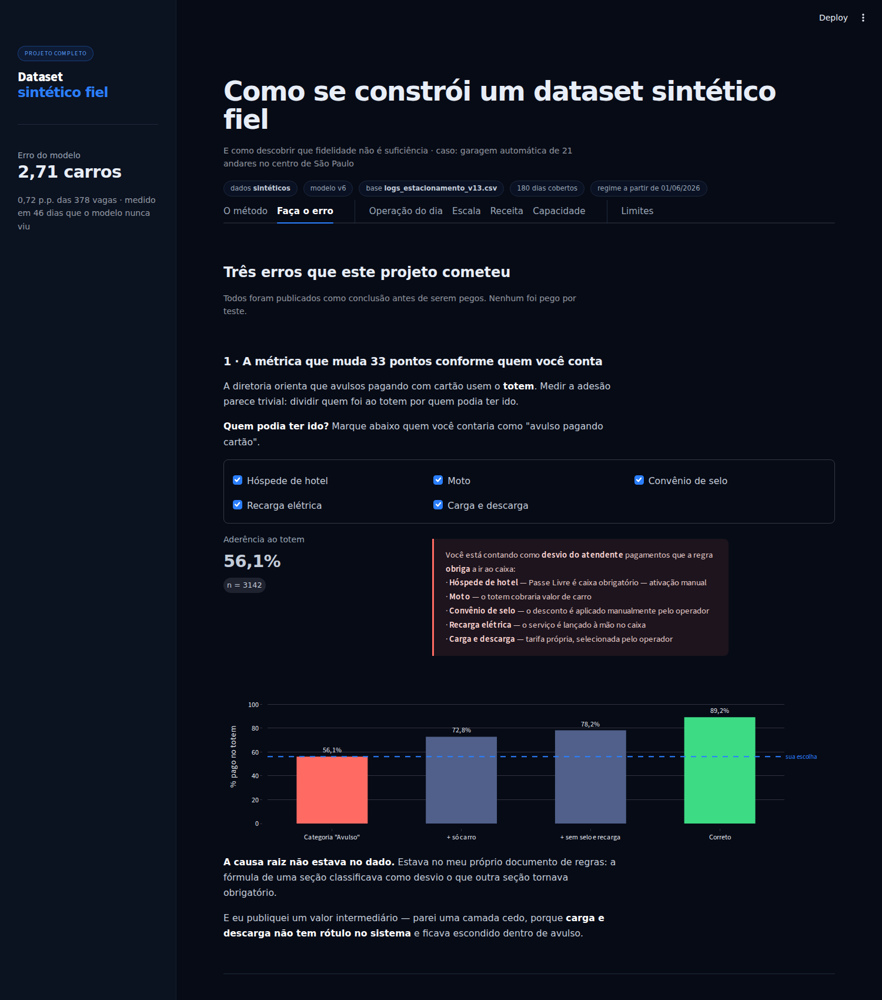
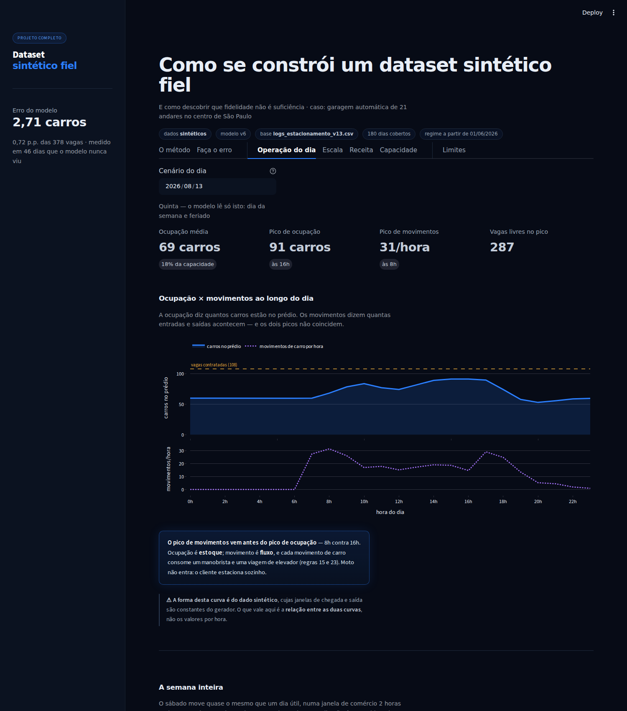
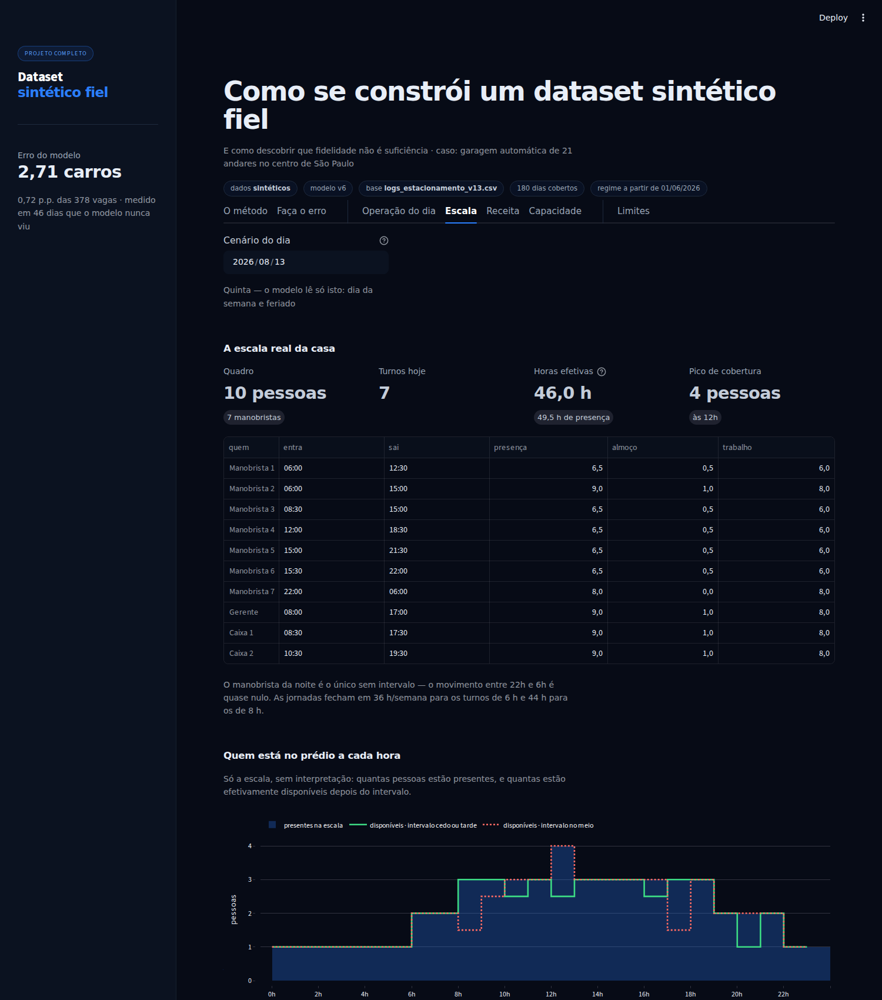

# Análise de um estacionamento que não podia dar os dados

**Como simular a operação de uma garagem automática de 21 andares, provar que a
simulação é fiel, e descobrir que fidelidade não é suficiência.**

Um projeto de análise de dados de ponta a ponta: geração de dataset sintético,
auditoria, EDA, modelo preditivo e um painel operacional. Feito com acesso ao
conhecimento de quem opera a garagem, mas sem acesso ao dado dela.

<p align="center">
  <a href="#"><b>▶ Abrir o app</b></a> ·
  <a href="#cinco-achados"><b>Os achados</b></a> ·
  <a href="docs/bastidores.md"><b>Os erros que eu cometi</b></a> ·
  <a href="#como-rodar"><b>Rodar localmente</b></a>
</p>

> **No app tem uma aba chamada "Faça o erro".** Ela deixa você reproduzir três dos
> erros deste projeto mexendo em controles — a métrica que muda 33 pontos conforme o
> denominador, a ocupação que estoura a capacidade física do prédio, e a vantagem do
> modelo que evapora quando o baseline recebe a mesma informação.

---

## O problema

Uma garagem automática no centro de São Paulo: 21 andares, três elevadores, 378
vagas de carro, ~60 de moto. Sessenta anos de operação. Manobrista, cartão físico
de vaga, rádio.

**Os dados reais não podem sair da empresa.** E dado sintético mal feito não ensina
nada — ele sempre parece certo, roda sem erro e preenche todas as colunas, mesmo
mentindo o tempo todo.

Então o projeto virou outra coisa: **mapear 39 seções de regras de operação** com
quem trabalha lá, transformar cada uma em código e em teste, e usar o dataset
resultante para responder perguntas de negócio de verdade.

---

<a id="cinco-achados"></a>

## Cinco achados

### O convênio de selos é vendido por menos do que desconta



O estacionamento vende o cupom ao lojista por **R$ 9**. Cada cupom desconta uma
hora, que custa **R$ 15**.

Um cupom apresentado sozinho **dá prejuízo em 100% dos casos** — daria lucro só numa
conta abaixo de R$ 9, e o mínimo da tabela é R$ 10.

E a virada: **quanto mais cupons o cliente apresenta, melhor para o estacionamento.**
Com três, o desconto ultrapassa a conta e o excedente evapora. Quem distribui três
selos subsidia a garagem; quem distribui um é subsidiado por ela.

### Depois da terceira hora, a vaga é de graça



A tabela cobra R$ 10 na meia hora, R$ 15 na primeira, R$ 8 por hora adicional — com
teto de R$ 30. O teto é atingido na **3ª hora** e vale até a 12ª.

Um quarto das estadias de avulso passa desse ponto e ocupa a vaga sem gerar mais
nada. **Não é erro de precificação** — pode ser exatamente o que atrai o cliente de
meio-período. É um custo que ninguém tinha calculado.

### O sábado ficou cheio e barato



O fim de semana tinha tabela própria e mais cara. Com a unificação de preços, o dia
útil alcançou o sábado e o prêmio sumiu.

E o sábado é o dia **mais pesado de operar**: move quase o mesmo número de carros
numa janela de comércio 2 horas mais curta. Como cada carro custa um manobrista e uma
viagem de elevador, é ele que dimensiona a equipe — não o dia útil.

### A demanda de recarga elétrica cresceu 8× em 11 meses



O carregador tem app próprio, fora do sistema do estacionamento. Doze meses lidos de
lá são **a única parte do dado que dá para conferir contra o mundo** — e o simulado
bate em **1,01× no volume e 0,99× na energia**.

A obra da 3ª tomada chegou na hora: com o volume atual, duas tomadas já deixam um em
cada oito motoristas sem vaga de recarga. Mas ela satura em ~5 recargas por dia, e o
achado não óbvio é que **potência rende mais que número de vagas**.

### Metade da vantagem do modelo era uma linha de código



Gradient Boosting e Random Forest venceram os baselines na previsão de ocupação. Mas
o período de teste ficava inteiro depois de uma mudança conhecida na operação — e as
árvores tinham aprendido isso.

Acrescentei um baseline que continua sendo baseline: **a mesma média por dia da
semana, calculada duas vezes, uma por regime.** Ele percorre **54% da distância** até
o Gradient Boosting, e o que sobra **não é estatisticamente significativo**
(Wilcoxon, p = 0,150).

O modelo gasta 92% da sua capacidade explicativa em três coisas — domingo, dia da
semana e feriado — que qualquer pessoa escreveria à mão.

---

## O painel

Não é um dashboard de estacionamento. É um app sobre **como se constrói e se audita
um dataset sintético** — com o painel operacional dentro, como demonstração.



### E ele deixa você cometer os erros



Três dos erros deste projeto viraram controles:

**Marque quem você contaria como "avulso"** e veja a aderência ao totem escorregar de
**89,2% para 56,1%** — porque cada segmento que você inclui é um pagamento que a regra
**obriga** a ir ao caixa.

**Ligue "contar tentativas barradas como entrada"** e a ocupação de moto vai para
**62 num espaço que comporta 60**. Nenhuma linha do dataset está errada; o erro só
existe na soma, e foi o número impossível que denunciou.

**Dê o degrau de junho ao baseline** e 54% da vantagem do Gradient Boosting evapora —
o que sobra não é estatisticamente significativo.

É mais rápido de entender errando do que lendo.

### E o painel operacional



Consome um artefato de ~14 KB, não o dataset de 15 MB.

O que ele faz de diferente de um dashboard comum: **liga a previsão ao que custa
dinheiro.** Prevê ocupação *e* manobras por hora — e os dois picos não coincidem,
porque ocupação é estoque e manobra é fluxo. É a segunda que dimensiona a equipe.



A aba de escala traz a **escala real da operação** — 10 pessoas, turnos, intervalos —
e um otimizador de cobertura de turnos resolvido como programa inteiro.

Foi ela que calibrou o único parâmetro que eu tinha inventado: rodando o otimizador
em vários ritmos, **o valor em que a escala mínima coincide com a praticada é o mesmo
em dia útil e no sábado.**

> ⏳ **O app hiberna** depois de um tempo sem acesso e leva ~30 s para acordar.

---

## O que este projeto não é

Está escrito no painel, na primeira aba que o usuário abre, e vale repetir aqui:

**A ocupação não é medida.** O sistema não sabe quantas vagas estão ocupadas — a
alocação é manual, com cartão físico. A ocupação é *reconstruída* somando entradas e
saídas.

**A previsão não foi validada contra a operação real.** O dataset é sintético. O que
o projeto demonstra é o **método**.

**A única parte conferida contra o mundo** é a recarga elétrica.

**Metade dos "achados" da primeira análise não eram achados.** Classifiquei os quinze
por origem, e oito eram o gerador reproduzindo os próprios parâmetros. Essa história
está em [bastidores.md](docs/bastidores.md) — é a parte de que mais me orgulho, e é
sobre errar.

---

## As cinco etapas

| Etapa | O que foi feito | Onde ler |
|---|---|---|
| **1 · Dataset** | Gerador dirigido por parâmetros, 25 asserções automatizadas | [v13.md](docs/v13.md) |
| **2 · Limpeza** | Duas limpezas: formato e sentido | [v13.md](docs/v13.md) |
| **3 · EDA** | 8 perguntas escolhidas antes de abrir o notebook | [eda.md](docs/eda.md) |
| **4 · Modelo** | Baseline vs. árvores, validação cronológica | [modelo.md](docs/modelo.md) |
| **5 · App** | Streamlit: método, erros interativos e painel operacional | [app/](app/) |

Documentação de apoio:

- [**regras_de_negocio.md**](docs/regras_de_negocio.md) — as 39 seções que sustentam
  tudo. É o documento mais importante do projeto.
- [**parametros.yaml**](dados/parametros.yaml) — a fonte única de verdade numérica,
  lida pelo gerador **e** pelo validador.
- [**bastidores.md**](docs/bastidores.md) — a auditoria de origem dos achados e os
  erros que ela encontrou.

---

## A decisão técnica de que mais gosto

**O gerador não tem nenhum número literal.** Tudo vem de um arquivo de parâmetros,
lido também pelo validador. Se um parâmetro não estiver declarado, o gerador quebra:

```
ParametroAusente: 'segmentos.morador.persona_ev_dependente_recargas_dia'
não está em parametros.yaml. Declare o parâmetro antes de usá-lo no gerador.
```

Isso existe porque a auditoria encontrou **oito números que viviam só no código** e
contradiziam ou faltavam no documento de regras — a tarifa de recarga, os valores de
mensalidade, a taxa de inadimplência, o bloqueio automático.

Nenhum dos testes anteriores pegava, porque o validador tinha as suas próprias
constantes, copiadas do gerador. Agora os dois leem o mesmo arquivo, e **um parâmetro
não pode mais divergir da regra escrita em silêncio.**

---

## Como rodar

```bash
git clone <este-repositório>
cd <pasta>
pip install -r requirements.txt
```

**O painel:**

```bash
cd app && streamlit run app.py
```

**Gerar o dataset do zero** (~1 min):

```bash
python scripts/Dataset_Final_v13.py
python scripts/valida_v13.py        # 25 asserções
```

**Refazer a análise:**

```bash
python scripts/eda3_negocio.py       # os 8 achados
python scripts/modelo_ocupacao_v13.py  # baseline vs. árvores
```

Detalhes e solução de problemas em [app/COMO_RODAR.md](app/COMO_RODAR.md).

---

## Ferramentas

Python · pandas · NumPy · scikit-learn · SciPy (Wilcoxon, Erlang B, programação
inteira) · Matplotlib · Plotly · Streamlit · PyYAML

---

## Licença

O **código** está sob [MIT](LICENSE) — use à vontade.

A **documentação de regras de negócio** (`docs/regras_de_negocio.md`) descreve a
operação real de uma empresa. Está publicada com autorização da gestão, para fins de
portfólio. Não é material para reuso comercial.

---

## Uma nota sobre o dado

O estabelecimento autorizou a publicação do projeto. **O nome não é citado** — por
decisão minha, não por falta de aprovação: o conteúdo inclui política comercial e
envolve terceiros que não autorizaram nada.

Todos os valores financeiros publicados vêm do **dataset sintético**. O que é real
são as **regras de operação**, a **escala de trabalho** e a **série de recarga
elétrica** — e cada uma está marcada como tal na documentação.

---

<p align="center">
  <a href="https://instagram.com/fabiods.tech">@fabiods.tech</a> ·
  <a href="#">LinkedIn</a>
</p>
